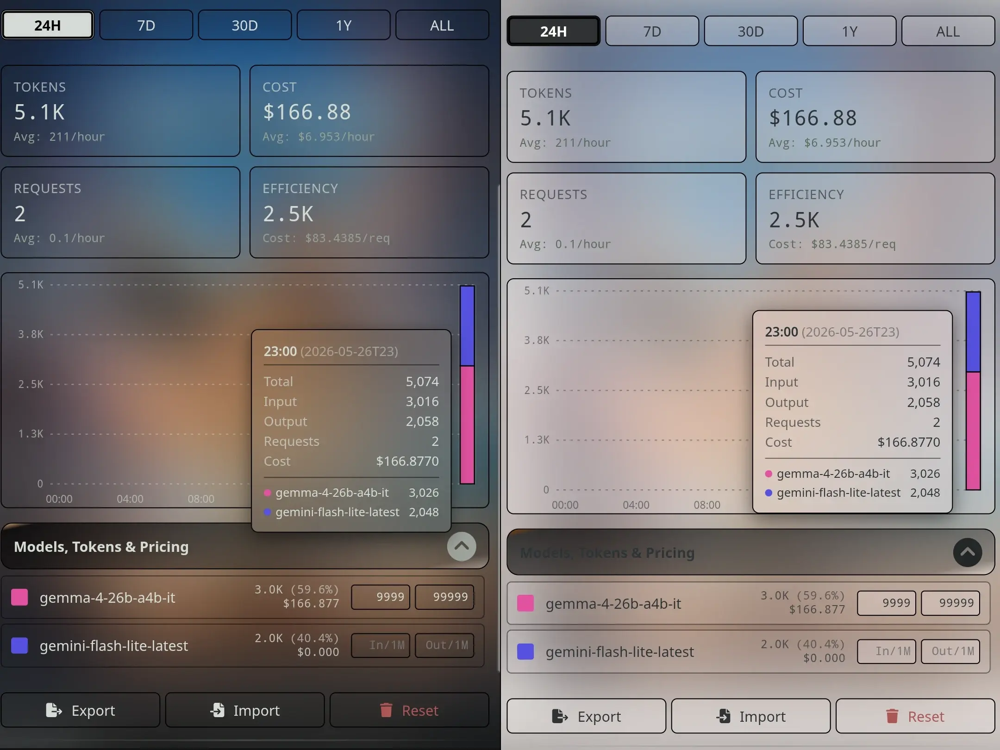

# SillyTavern Token and Cost Statistics



An optimized, feature-rich SillyTavern extension that tracks, visualizes, and calculates costs for your chat tokens. 

This repository is a fully modernized fork of the original [Vibecoder9000/Extension-TokenUsage](https://github.com/Vibecoder9000/Extension-TokenUsage), rewritten to align with modern SillyTavern extension standards, improve query performance, and prevent configuration file bloat.

Tested on:
- [SillyTavern](https://github.com/SillyTavern/SillyTavern)
- [TauriTavern](https://github.com/Darkatse/TauriTavern)
---

### Author's Note

Hey there. I'm professional cashier.

and I'm going to be completely honest with you.

**I have zero coding knowledge + I built this entire fork on my mobile phone.** 

To get this code clean, and actually working, I basically had to use an LLM back and forth multiple time. I forced the AI to act like a adversarial code auditor (literally telling it to review my code like an angry ex-partner who hates me lol). 

I did this because I wanted to learn something useful, build a skill that can earn me some money. (Then again I don't know if I will learn anything if I rely on AI. I hope at least i learn the patterns.)

If you find this extension useful or you just want to help a self-taught mobile developer to build up a saving, any support means the world to me.

*   **Support my work on Ko-fi:** [ko-fi.com/homelessqueen](https://ko-fi.com/homelessqueen)
*   **Read more about me:** [kurohomeless.pages.dev](https://kurohomeless.pages.dev)

If you find the code is trash, please do tell me ad well so i can fix it.

---

## Features

- **Granular Timeframe Aggregation:** Toggle statistics and interactive charts across **24H** (hourly blocks), **7D**, **30D** (daily blocks), **1Y** (monthly blocks), and **ALL** (total recorded history).
- **Native API-Reported Harvesting:** Automatically extracts direct token usage metadata (e.g., from OpenRouter, Claude, OpenAI) to provide exact token counts, bypassing any local counting inaccuracies.
- **Background Generation Tracking:** Hooks SillyTavern's `ConnectionManagerRequestService` and quiet generation pipelines to capture token usage consumed by backend extensions (such as summarization, vector database indexing, or external triggers).
- **Model Name Normalization:** Strips provider and API-specific tags (e.g., mapping `openai/gpt-4o-2024-05-13` to `gpt-4o`) so you can configure color themes and pricing rules once without configuration duplication.
- **Timezone-Safe Bucketing:** Leverages SillyTavern's bundled `moment.js` library to format dates safely across varying local timezones.
- **Export & Import Tools:** Fully integrated backup and restore functions allow you to export your data as JSON and restore it seamlessly with input sanitization checks.

---

## Technical Comparison & Trade-offs

| Aspect | This Fork (`kurohomeless`) | Original (`Vibecoder9000`) |
| :--- | :--- | :--- |
| **Pruning & Storage Safeguards** | **Yes.** Automatically prunes old hourly (7 days) and daily (365 days) records to keep your `settings.json` lightweight. | **No.** Appends history indefinitely, which can eventually increase your settings file size. |
| **Hot-Reload Safety** | **Yes.** Safely detaches event handlers and observers on reload to prevent memory leaks and duplicate runs. | **No.** Background processes and listeners can stack up recursively if the extension is reloaded. |
| **Slash Commands (`/tokenusage`)** | **No.** Slash commands were removed to keep the codebase simplified. | **Yes.** Includes native Slash commands to query stats directly from the chat bar. |
| **Built-in Model Price Dictionary** | **No.** Uses a lightweight matching fallback; you enter your preferred prices manually in the UI. | **Yes.** Includes a large built-in dictionary to automatically resolve OpenRouter model prices. |
| **Rendering Performance** | **Aggregated.** Stats are pre-grouped at write-time, keeping UI loads fast regardless of history size. | **On-the-fly.** Recalculates weekly/monthly data dynamically, which can slow down as your history grows. |
| **UI Stylesheet Separation** | All layout code is strictly separated into `style.css` for clean ST skin compatibility. | Layout rules are embedded directly inside JavaScript template strings. |

---

## Installation

1. Open SillyTavern and navigate to the **Extensions** menu (the blocks icon in the top navigation bar).
2. Click on **Install Extension**.
3. Paste this repository's URL into the "Extension URL" field:
   ```text
   https://github.com/kurohomeless/SillyTavern-Token-and-Cost-Statistics
   ```
4. Click **Install**.

---

## Usage

Once installed, the extension runs automatically in the background.

- **Viewing Stats:** Open your SillyTavern **Extensions** panel on the right sidebar and expand the **Token Usage and Cost Statistics** drawer.
- **Configuring Prices:** Within the models list, assign custom hex colors and enter input/output prices per 1,000,000 tokens (e.g., `5.00` for $5.00/1M tokens) to automatically estimate chat costs.
- **Backup & Restore:** Use the **Export**, **Import**, and **Reset** utility buttons at the bottom of the drawer to manage your statistics files.

---

## Prerequisites

- SillyTavern Version `>= 1.12.0`

## License

[AGPL-3.0](LICENSE)
